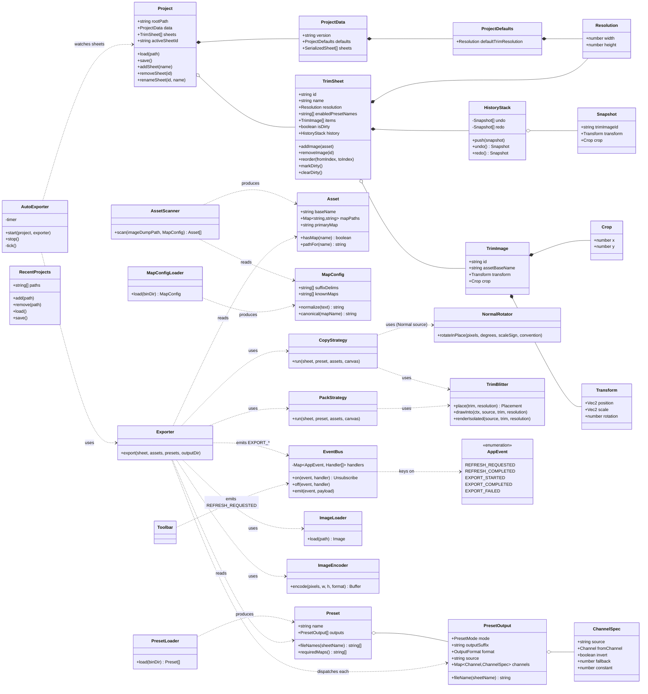
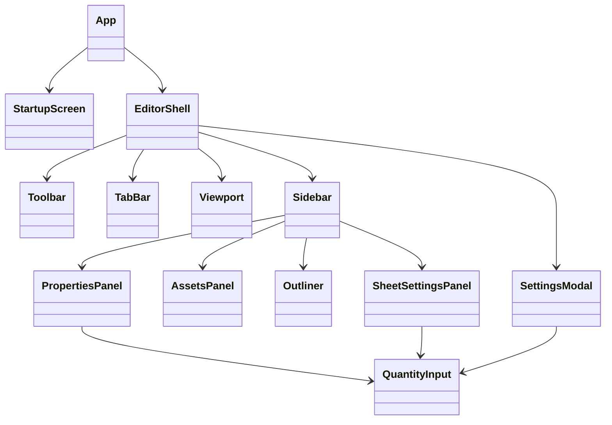

# LJ Trim Master — Class & File Structure (Phase 1)

Stack: Electron + TypeScript + React. Two runtime processes:

- **Main** — filesystem I/O (project scaffolding, scanning `image_dump/`, loading `preset-packs/` and `maps.yaml`, writing `/output`) and the export pipeline.
- **Renderer** — React UI and in-memory editor state. Talks to main over IPC.

One class/object per file. UI components live under `renderer/ui/`, plain data models under `renderer/models/`, non-UI logic under `renderer/services/` and `main/`.

## Class Relationship Diagram



## UI Component Tree



## Folder & File Layout

```
LJTrimMaster/
  package.json
  tsconfig.json
  electron.vite.config.ts
  maps.yaml                          # ships next to binary
  preset-packs/                      # ships next to binary
    copy.template.yaml
    pack.template.yaml

  main/                              # electron main process
    main.ts                          # app bootstrap, window creation, ljtm:// protocol
    preload.ts                       # contextBridge surface (the only renderer<->main door)
    ipc.ts                           # IPC channel wiring
    menu.ts                          # AppMenu — native application menu
    fs/
      projectFs.ts                   # new/open/save project on disk
      assetScanner.ts                # AssetScanner
      presetLoader.ts                # PresetLoader
      mapConfigLoader.ts             # MapConfigLoader
      recentProjects.ts              # RecentProjects (user-scoped config)
    export/
      exporter.ts                    # Exporter — orchestrates, encodes, writes
      copyStrategy.ts                # CopyStrategy
      packStrategy.ts                # PackStrategy
      normalRotator.ts               # NormalRotator
      trimBlitter.ts                 # shared transform + crop geometry
      imageLoader.ts                 # decode + per-run cache
      imageEncoder.ts                # PNG / JPG / TGA encoding
      renderedSheet.ts               # what a strategy hands back
    autoExport/
      autoExporter.ts                # AutoExporter (timer)

  renderer/
    index.html                       # renderer entry document
    App.tsx                          # root, routes Startup <-> Editor
    index.tsx
    styles.css                       # all editor chrome; components stay markup-only

    ui/                              # UI in its own folder
      startup/
        StartupScreen.tsx
      editor/
        EditorShell.tsx
        Toolbar.tsx
        TabBar.tsx
        Viewport.tsx
        sidebar/
          Sidebar.tsx
          PropertiesPanel.tsx
          AssetsPanel.tsx
          Outliner.tsx
          SheetSettingsPanel.tsx
        modals/
          SettingsModal.tsx          # project defaults (default trim resolution, etc.)
          HowToUseModal.tsx          # quick reference, opened from Help > How To Use (F1)
        controls/
          QuantityInput.tsx          # reusable value editor

    models/                          # one class per file
      Project.ts
      ProjectData.ts
      ProjectDefaults.ts
      TrimSheet.ts
      TrimImage.ts
      Transform.ts
      Vec2.ts
      Crop.ts
      Resolution.ts
      Asset.ts
      MapConfig.ts
      Preset.ts
      PresetOutput.ts
      ChannelSpec.ts
      HistoryStack.ts
      Snapshot.ts

    state/                           # renderer state stores (zustand or ctx)
      projectStore.ts                # active Project, activeSheetId
      selectionStore.ts              # currently selected TrimImage id
      assetsStore.ts                 # scanned Asset list
      presetsStore.ts                # loaded Preset list

    services/                        # renderer-side IPC callers
      bridge.ts                      # typed window.ljtm accessor + assetUrl()
      appBus.ts                      # renderer EventBus instance + IPC bridge
      projectService.ts              # wraps main/fs/projectFs
      refreshService.ts              # wraps the refresh entry point
      exportService.ts               # wraps main/export/exporter
      autoExportService.ts           # wraps main/autoExport

  shared/
    types.ts                         # enums shared across processes
    ipcChannels.ts                   # channel name constants
    events/
      EventBus.ts                    # typed pub/sub; one instance per process
      AppEvent.ts                    # event name enum + payload types
```

## Class Notes

**Data model (`renderer/models/`)** — plain TS classes, no React, no IPC. Each holds only its own state and the methods that mutate it. Persisted via `ProjectData` (serialization surface).

- `Project` — root aggregate. Owns the sheet list, active sheet id, and `ProjectData`. `load`/`save` go through `projectService` → IPC → `projectFs`.
- `ProjectData` — the shape of `projectData.json`. Version-stamped for future migrations.
- `ProjectDefaults` — project-wide defaults edited from the Settings modal. Currently just `defaultTrimResolution`, applied when a new `TrimSheet` is created. Extensible.
- `TrimSheet` — one tab. Owns items in draw order (index 0 = bottom), the `isDirty` flag consumed by `AutoExporter`, and its own `HistoryStack`.
- `TrimImage` — a placed image on a sheet. References an asset by `baseName` (not by absolute path), so sibling maps are resolved at export time.
- `Transform` / `Crop` / `Resolution` — value objects.
- `Asset` — one logical texture with its map siblings resolved. Produced by `AssetScanner` from `image_dump/` using `MapConfig`.
- `MapConfig` — the `maps.yaml` content. Holds the delimiter list; `normalize()` rewrites every configured delimiter to a single `_` so `AssetScanner` can do an ordinary one-delimiter split.
- `Preset` / `PresetOutput` / `ChannelSpec` — the `preset-packs/*.yaml` content. A preset is a named bundle of outputs, so one preset ("Unity HDRP") writes several textures. Identity is `name:` not filename.
- `HistoryStack` / `Snapshot` — transform+crop only, per-sheet.

**Main-process services**

- `AssetScanner` — walks `image_dump/` **and its subfolders** (depth-limited, dot-folders skipped), normalizes each stem through `MapConfig`, groups files by base + known suffix. A file in a subfolder carries the folder in its base name (`stone/wall`), so identically named textures in different folders stay separate assets and top-level names are unchanged from before subfolder support. Returns `Asset[]` plus warnings for files that collide on the same base+map slot.
- `MapConfigLoader` / `PresetLoader` — YAML readers, run on startup and on refresh. `PresetLoader` warns on duplicate `name:` and keeps the first.
- `RecentProjects` — user-scoped config file listing recent project paths for the Startup screen.
- `Exporter` — for one sheet, walks each enabled preset's outputs and dispatches each to its strategy. Handles output filename: `<TrimName><outputSuffix>.<ext>`. A failed output doesn't stop the preset's other textures.
- `CopyStrategy` — blits one map (sampled + transformed) onto the output canvas for one `PresetOutput`. If `source: Normal`, routes pixel writes through `NormalRotator`.
- `PackStrategy` — for one `PresetOutput`, reads each channel's `source` map (or `constant`), applies `fromChannel`/`invert`/`fallback`, writes into the target channel. `source: Normal` is refused at load time.
- `NormalRotator` — rotates the (R,G) vector of each sampled pixel by the trim's rotation, flips R/G on negative scale, leaves B untouched.
- `AutoExporter` — timer loop; while enabled, checks each sheet's `isDirty` and re-runs `Exporter` for dirty sheets, then clears the flag.

**Renderer state (`renderer/state/`)** — thin stores over the models. UI subscribes to them; models don't know React exists.

**UI (`renderer/ui/`)** — dumb-ish components. Read from state stores, dispatch through services. `QuantityInput` is the shared control used by `PropertiesPanel` (transform + crop), `SheetSettingsPanel` (per-sheet resolution), and `SettingsModal` (project defaults).

- `SettingsModal` — opened by the toolbar's settings gear. Edits `Project.data.defaults` (currently `defaultTrimResolution`). Saved values seed newly-created trim sheets; existing sheets keep their own per-sheet resolution.

## Event Bus

Shared pub/sub used across the app so features can hook into cross-cutting actions without direct coupling. One `EventBus` instance per process (main and renderer each get their own); events that need to cross the process boundary are bridged over IPC.

**Scope is intentionally narrow.** Only two families are on the bus: `REFRESH_*` and `EXPORT_*`. Everything else — property edits, selection, tab switches, project open/save — goes through state stores or direct service calls. If you find yourself reaching for a new event name outside those two families, prefer a store subscription or a direct call instead.

### Events (v1)

| Event | Emitted by | Payload | Typical listeners |
|---|---|---|---|
| `REFRESH_REQUESTED` | `Toolbar` refresh button | — | `MapConfigLoader`, `PresetLoader`, `AssetScanner`, `presetsStore`, `assetsStore` |
| `REFRESH_COMPLETED` | main after all reload work finishes | `{ mapConfig, presets, assets }` | Any panel that shows counts / statuses |
| `EXPORT_STARTED` | `Exporter` at the start of a sheet export | `{ sheetId, presetNames }` | UI status/spinner, logging |
| `EXPORT_COMPLETED` | `Exporter` on success | `{ sheetId, outputPaths }` | UI toast, Blender sync (later) |
| `EXPORT_FAILED` | `Exporter` on error | `{ sheetId, presetName, error }` | UI error toast, logging |

### Wiring

- Toolbar's refresh button calls `bus.emit(REFRESH_REQUESTED)`. Any region that needs a reload subscribes on mount; there's only one refresh entry point, but many subscribers — matches the "shared control" note in Draft.
- `Exporter` emits export events unconditionally (both manual Build and Auto Export paths flow through it), so listeners don't need to distinguish source.
- `AutoExporter` clears `TrimSheet.isDirty` **inline** after `Exporter.export()` returns — not via the bus. There's only one emitter and one dirty-owner in the same process; a bus round-trip would just hide the flow. Events are reserved for genuine broadcasts (multiple listeners that don't know about each other).
- **The Blender addon does NOT subscribe to anything.** Phase 3 replaced the planned hook-file subscription: there is no IPC, no watcher and no process link between the tool and Blender. The two halves communicate only through files on disk — the addon re-reads `projectData.json` on an mtime cache, and writes the `blender_links/` sidecar the tool reads on refresh. Left here because the original note claimed otherwise.

## What's Not in v1

- Unity addon (Phase 4) is a separate deliverable and not in this diagram. The Blender addon (Phase 3) is built — see `Blender/README.md` and **Resolved During Phase 3** below.
- No canvas interaction beyond preview + selection outline — selection and moves happen through the Outliner + Properties panel.
- No undoable add/remove/reorder/rename.
- No overlap-avoidance or grid snapping.

## Resolved During Phase 2

Four ambiguities in the Phase 1 diagram were settled before coding. Recorded here so they aren't re-litigated.

| Question | Decision |
|---|---|
| `Transform.rotation` type | **Scalar `number`, degrees CCW.** The `Vec2` above was a typo — corrected in the diagram. A single angle is what `NormalRotator` and 2D placement need. |
| Units of `position` / `scale` | **Stored normalized 0–1** against the sheet; **displayed as pixels** in `PropertiesPanel`. Resizing a sheet preserves its layout proportionally, and Phase 3's UV sync gets UV-space numbers with no conversion. The px↔normalized conversion lives in `PropertiesPanel` and nowhere else. |
| `Crop` semantics | **Symmetric inset per axis.** `crop.x` trims equally off the left AND right edges, `crop.y` off top AND bottom, so a trim stays centred as it is cropped in. Stored 0–0.5, clamped by `Crop.clamp`. |
| Phase 2 scope | **UI + models + real filesystem services.** The export pipeline (`Exporter`, `CopyStrategy`, `PackStrategy`, `NormalRotator`, `AutoExporter`) is scaffolded with final signatures and real `EXPORT_*` event choreography; the pixel work throws until the export phase. |

### Additions to the Phase 1 layout

Small structural pieces the diagram didn't name, added out of necessity:

- **`main/preload.ts`** — `contextIsolation` is on, so the renderer needs a `contextBridge` surface to reach IPC at all. Exposes only `invoke` and `onBusEvent`.
- **`renderer/models/Vec2.ts`** — referenced by `Transform` in the Phase 1 diagram but never given a file.
- **`renderer/services/bridge.ts` / `appBus.ts`** — the typed `window.ljtm` accessor, and the renderer's own `EventBus` instance with the IPC bridge attached.
- **`ljtm://` protocol** (in `main.ts`) — the renderer can't read `image_dump/` directly under `contextIsolation`, and shipping every thumbnail through IPC as a data URL would be wasteful. `` streams off disk instead.

## Export Pipeline Notes

Built on `@napi-rs/canvas` (N-API, so no `electron-rebuild`) with `pngjs` for PNG encoding.

**Geometry lives in one place.** `TrimBlitter` resolves a trim's normalized transform into sheet pixels and performs the crop+transform draw. Both strategies call it, so a preset's BaseColor and MaskMap land on identical pixels — if they diverged, the material wouldn't line up.

**Rotation sign.** `Transform.rotation` is counter-clockwise-positive. CSS `rotate()` and canvas `rotate()` are both clockwise-positive, so the Viewport and `TrimBlitter` each negate on the way in. Change one and you must change the other, or the preview stops predicting the export.

**A packed output's alpha is data, not coverage.** On an HDRP mask map it is smoothness. Two consequences:

1. *Compositing.* `PackStrategy` builds each sheet as two opaque canvases — one holding RGB, one holding A as greyscale — and draws every trim onto both with the trim's own coverage as the blend alpha. Drawing a packed image directly would make a trim's smoothness decide how transparently it composites.
2. *Encoding.* A canvas surface stores premultiplied alpha, so a pixel of `(metallic 200, AO 100, detail 50, smoothness 0)` round-trips to `(0,0,0,0)` — verified against `@napi-rs/canvas`, not assumed. The strategies therefore return a plain unpremultiplied RGBA buffer (`RenderedSheet`), and `ImageEncoder` writes PNGs through `pngjs`. The canvas is only used for JPEG, which has no alpha to lose.

**Uncovered sheet area** gets each channel's `fallback` for pack outputs, and stays transparent for copy outputs.

**Failure granularity.** A failed output emits `EXPORT_FAILED` and the preset's other textures still export. A missing source map is not a failure at all — the channel falls back and the reason is reported in `EXPORT_COMPLETED.warnings`, prefixed with the file it belongs to.

**Packaging.** `@napi-rs/canvas` ships a `.node` binary that must be `asarUnpack`'d when electron-builder is configured; it cannot load from inside an asar.

## Application Menu

`AppMenu` (`main/menu.ts`) replaces Electron's default menu with File / View / Help. **Help > How To Use** (F1) sends `MENU_COMMAND` over its own IPC channel — not the EventBus, which stays reserved for `REFRESH_*` and `EXPORT_*`; a menu click has exactly one listener, so a direct call is the right shape. `App` subscribes at the root, so the panel opens on the startup screen as well as in the editor.

`HowToUseModal` reads the map vocabulary from `assetsStore` and the presets from `presetsStore` rather than hardcoding them, so it always describes the user's actual `maps.yaml` and `preset-packs/`.

**There is deliberately no Edit > Undo/Redo.** Menu accelerators are consumed before the renderer sees the keystroke, so a `role: 'undo'` item bound to CmdOrCtrl+Z would swallow the shortcut and run the focused text field's undo instead of the sheet's transform undo. If an Edit menu is ever added — macOS needs one for the clipboard roles to bind — it must leave that accelerator alone.

## Resolved During Phase 3

The Blender addon is a separate deliverable with its own architecture doc
(`Blender/README.md`). Only what it changed on **this** side is recorded here.

### Additions to the layout

```
main/fs/
  blenderLinksReader.ts            # BlenderLinksReader - reads blender_links/*.json
renderer/state/
  blenderLinksStore.ts             # trim_id -> [linked Blender objects]
```

### Decisions

| Question | Decision |
|---|---|
| Where does `moveImage` live? | **`Project`**, not `TrimSheet` — it spans two sheets. Preserves `id` (the addon's only resolution key), recomputes the transform to preserve *pixel* geometry, marks both sheets dirty, appends to the target so it lands on top of the z-order. **Not undoable**, consistent with add/remove/reorder/rename. |
| How does the tool learn about Blender links? | **A sidecar file the addon writes**, `<root>/blender_links/<stem>-<hash>.json`, folded into `RefreshResult` so project load and manual Refresh both pick it up. **Read-only and possibly stale** — the `.blend` may have moved or been deleted, and nothing checks. |
| What does the tool do with them? | **Warn before deleting a trim or a sheet that objects are linked to. Warn, never block.** A native `confirm` at the two call sites (Outliner remove, TabBar sheet close) rather than a new modal component: it is a guard on a rare destructive path, not a workflow. |
| Is `projectData.json` written atomically? | **Yes, and it has to be.** The addon reads it while the tool autosaves 800 ms after every edit. Temp-then-rename, serialized per root, with a retried rename — see Verified Fact 12 in `HANDOFF.md` for why the retry is not optional on Windows. |
| Duplicate trim ids? | **Re-minted in `ProjectFs.migrate`.** `randomUUID` never collides in practice, but a duplicated sheet block or hand-edited JSON would, and `trim_id` is the addon's only resolution key — an ambiguous lookup means UVs transformed against the wrong sheet. The **first** occurrence keeps its id, so an existing link survives and only the copy reports a missing link. |

### The one invariant that spans both sides

`main/export/trimBlitter.ts` draws the pixels; `Blender/lj_trim_master/uv_transform.py`
moves the UVs onto them. **They must agree exactly**, and a disagreement is a
silent misalignment with no error anywhere. `Blender/tests/test_affine.py` asserts
that agreement against an independent reimplementation of `TrimBlitter`'s canvas
composition. **Change one and you must change the other**, and that test is how
you find out you forgot.
