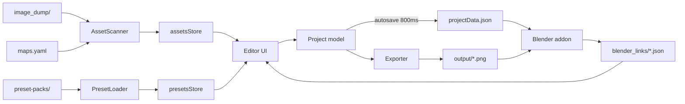

# LJ Trim Master

**A desktop tool for authoring trim sheets / texture atlases *after* the textures
exist, plus integrations that keep already-unwrapped models correct when the
layout changes.**

This file is the single orientation document. It is written to be read
front-to-back by someone (or something) with no prior context, and it supersedes
scattered reading of the design docs. Those docs still exist and go deeper — see
[Document map](#document-map) at the end.

---

## 1. The idea, in one page

Conventional trim-sheet workflows force the layout decision **early**: you pack a
sheet, then unwrap models against the packed sheet. Change the packing later and
every model that used it is wrong.

LJ Trim Master inverts that:

1. Texture each material **independently**, as its own 0–1 image. Drop those
   images in the project's `image_dump/`.
2. **Unwrap models against those individual images**, 0–1, the normal way. The
   viewport shows one texture at full resolution — not a corner of an atlas.
3. **Compose the trim sheet later**, in the tool: drag each image into a sheet,
   position/scale/rotate/crop it. The tool renders the packed textures.
4. **The integration fixes the UVs at export time.** A model's stored UVs are
   never touched. When it is exported, the addon applies the affine that maps
   "this image's 0–1 space" onto "where that trim currently sits on the sheet".

The consequence that makes it worth building: **moving a trim on the sheet costs
nothing.** The models do not need re-unwrapping; they need re-exporting. The
layout stays editable forever.

**The tool is renderer-agnostic.** It authors trim sheets and the UV transforms
that go with them and does not care what consumes them. Unity and Blender are the
first two integrations, not the target. That is *why* the Blender addon covers
every export format — someone shipping OBJ into Substance or USD into lookdev
must get the same corrected UVs as someone shipping FBX into Unity.

---

## 2. Status

| Phase | Scope | State |
|---|---|---|
| 1 | Class diagram, code structure | Complete |
| 2 | Editor UI + export pipeline | Complete. **Launched and working.** |
| 3 | Blender sync addon | Complete, then **reworked**: scene registry + one-panel UI. All suites pass. GUI panel never clicked. |
| 4 | Unity addon | Not started. Its data channel already exists (§9). |

Builds clean, typechecks clean (`tsc --noEmit`), `electron-vite build` clean.

**Largest remaining unknown:** the Blender addon has never been run against a
real ZenUV-trimmed production asset — only hand-built quads and the default cube.
ZenUV is installed on the dev machine.

---

## 3. Repo layout

```
LJTrimMaster/
  README.md            <- you are here
  Draft.md             product spec / source of truth for behaviour
  ClassDiagram.md      architecture, mermaid diagrams, Phase 1/2/3 decision records
  HANDOFF.md           the addon rework brief + "verified facts, do not re-derive"
  HANDOFF_Test.md      brief for a session testing the addon
  Bugs.md              the live bug list
  Brainstroming.md     Unity ideas. OUT OF SCOPE.

  maps.yaml            map-suffix vocabulary   } ship next to the binary,
  preset-packs/*.yaml  output presets          } NOT inside a project

  main/                Electron main process
    main.ts            bootstrap, one window, the ljtm:// protocol
    preload.ts         the only renderer<->main door (contextBridge)
    ipc.ts             every IPC channel wired to its service
    menu.ts            native application menu
    fs/                projectFs, assetScanner, presetLoader, mapConfigLoader,
                       recentProjects, blenderLinksReader
    export/            exporter, copyStrategy, packStrategy, normalRotator,
                       trimBlitter, imageLoader, imageEncoder, renderedSheet
    autoExport/        autoExporter (timer)

  renderer/            React UI + in-memory state
    App.tsx            routes StartupScreen <-> EditorShell
    models/            plain TS classes. No React, no IPC.
    state/             zustand stores over the models
    services/          renderer-side IPC callers
    ui/                startup/, editor/{sidebar,modals,controls}
    styles.css         all editor chrome; components stay markup-only

  shared/              types.ts, ipcChannels.ts, events/
  Blender/             the extension  (see §8, and Blender/README.md)
    lj_trim_master/    the add-on package: uv_transform, project, assignment,
                       settings, export_hook, sidecar, material, panel
    tests/             four headless test scripts
  Blender Export Write Test/
                       the prior-art extension the export hook was proven in
```

**Convention: one class/object per file.** UI in `renderer/ui/`, data models in
`renderer/models/`, non-UI logic in `main/` and `renderer/services/`.

---

## 4. Running and testing

```bash
# The tool
npm install
npm run dev          # electron-vite dev
npm run build        # electron-vite build
npm run typecheck    # tsc --noEmit

# The Blender addon. blender.exe is NOT on PATH.
BLENDER="C:/Program Files/Blender Foundation/Blender 5.1/blender.exe"

python Blender/tests/test_affine.py                                              # 43 checks, no Blender needed
"$BLENDER" --background --factory-startup --python Blender/tests/probe_uvwarp.py        # 11 checks
"$BLENDER" --background --factory-startup --python Blender/tests/smoke.py               # register/draw canary
"$BLENDER" --background --factory-startup --python Blender/tests/test_sync_roundtrip.py # 97 checks
```

All of them exit non-zero on failure and run in a **separate headless process**, so
an open Blender session is never disturbed. Blender 5.1.2 is the dev target; 4.5
is also installed. **Never drive exporters through the Blender MCP bridge — it
crashed Blender twice.**

Packaging the add-on for distribution:

```powershell
LJTrimMaster/Blender/build.ps1     # -> Blender/dist/lj_trim_master-<version>.zip
```

It packs through `blender --command extension build`, which validates
`blender_manifest.toml` — a malformed manifest fails here rather than at the
user's install.

The addon is installed live as a directory junction, so repo edits take effect on
add-on reload:

```
%APPDATA%\Blender Foundation\Blender\5.1\extensions\user_default\lj_trim_master
  -> <repo>\LJTrimMaster\Blender\lj_trim_master
```

---

## 5. `projectData.json` — the contract between the two halves

Lives at the project root. **This file is the entire interface.** The tool writes
it; every integration reads it. Nothing else crosses the boundary in that
direction.

```json
{
  "version": "1",
  "defaults": { "defaultTrimResolution": { "width": 2048, "height": 2048 } },
  "sheets": [{
    "id": "uuid", "name": "Trim01",
    "resolution": { "width": 2048, "height": 2048 },
    "enabledPresetNames": ["Unity HDRP"],
    "items": [{
      "id": "uuid", "assetBaseName": "wood",
      "transform": { "position": {"x":0.5,"y":0.5}, "scale": {"x":0.25,"y":0.25}, "rotation": 0 },
      "crop": { "x": 0, "y": 0 }
    }]
  }]
}
```

Semantics that are easy to get wrong:

| Field | Meaning |
|---|---|
| `position` | The trim's **centre**, normalized 0–1 against the sheet |
| `scale` | Size normalized 0–1 against the sheet. **A negative component mirrors that axis** — the sign *is* the mirror |
| `rotation` | **Degrees, counter-clockwise-positive** |
| `crop` | **Symmetric inset**, normalized 0–0.5. `crop.x` trims equally off left AND right; `crop.y` off top AND bottom, so the trim stays centred as it crops in |
| `items` order | **Draw order.** Index 0 is drawn first (bottom). The Outliner shows this list *reversed* |
| `id` on an item | The **trim id**. Project-wide unique, re-minted on load if duplicated. This is the integration's only resolution key |
| `assetBaseName` | The tool's **normalized** name (§7), not necessarily a filename |
| `visible` (optional) | `false` means the trim is **not on the sheet**: the exporter skips it and the addon refuses to transform onto it. Absent means visible |
| `maps` (optional) | Cached copy of `maps.yaml` — see below |

`history` and `isDirty` are runtime-only and not serialized.

**The `maps` block** caches the tool's `maps.yaml` vocabulary into the project:

```json
"maps": { "suffixDelims": ["_","-","."], "knownMaps": ["BaseColor","Normal", "..."] }
```

`maps.yaml` lives next to the tool binary, not in the project, so an integration
reading only `projectData.json` cannot see it — and without it the Blender addon
cannot tell where a base name ends and a map suffix begins, so the two sides
disagree about what an asset even *is*. The editor re-stamps it whenever a
refresh loads the vocabulary and saves immediately, since a refresh is not an
edit and nothing else would flush it. It is therefore only as current as the last
time the editor was open. Optional: readers fall back to their own defaults.

**Written atomically** (temp + rename, serialized per root, retried rename). The
tool autosaves 800 ms after every edit while the addon may be reading — see
Verified Fact 12 in §11.

### Project folder layout

```
<projectRoot>/
  projectData.json
  image_dump/         SOURCE OF TRUTH. Models are unwrapped against these images.
  placeholder slots/  reserved, currently unused
  output/             everything the exporter writes
  blender_links/      written by the Blender addon, read by the tool (§9)
```

---

## 6. The tool

Electron + TypeScript + React via `electron-vite`. Runtime deps: `@napi-rs/canvas`,
`pngjs`, `yaml`, `zustand`.

**Main process** owns all filesystem I/O and the export pipeline.
**Renderer** owns UI and in-memory state. `contextIsolation` is on, so the
renderer reaches main only through `preload.ts`, which exposes exactly `invoke`,
`onBusEvent` and `onMenuCommand`.

### Data flow



### Renderer state

The models are **mutable classes that zustand cannot see into**, so every
mutating store action bumps a `rev` counter. Components subscribe to `rev`
("something changed") and read actual values straight off the model. That keeps
models React-free and avoids deep-cloning a sheet on every drag of a
`QuantityInput`.

Stores: `projectStore` (the open Project + `rev`), `selectionStore` (selected trim
id), `assetsStore` (the scan + its MapConfig), `presetsStore`, `blenderLinksStore`.

### Export pipeline

`Exporter` takes one sheet, walks each enabled preset's outputs, and dispatches
each to `CopyStrategy` (passthrough of one map) or `PackStrategy` (channel
composite). Both call `TrimBlitter` for geometry, so a preset's BaseColor and
MaskMap land on **identical pixels** — if they diverged, the material would not
line up.

- **Failure is per-output.** One preset's mask map blowing up does not cost the
  sheet its base colour.
- **A missing source map is not a failure at all** — the channel falls back and
  the reason lands in `EXPORT_COMPLETED.warnings`.
- **Coverage comes from the trim's BaseColor alpha**, for every output. A
  cut-out silhouette therefore masks Normal and MaskMap identically, instead of
  each map contributing its own opaque rectangle behind a cut-out base colour.
  No BaseColor map falls back to the drawn map's own alpha.
- **Hidden trims are skipped entirely** — hiding means "not on the sheet", not
  "not in the preview".
- **Uncovered sheet area** gets each channel's `fallback` for pack outputs and
  stays transparent for copy outputs. That is what keeps an empty region of a
  mask map reading as *unoccluded* rather than fully-occluded black, so UV bleed
  at a trim edge does not darken a seam.
- Output filename is `<SheetName><outputSuffix>.<ext>`, filesystem-illegal
  characters replaced; spaces and hyphens preserved.

**Alpha is data, not coverage.** On an HDRP mask map, alpha is smoothness. Two
consequences, both verified rather than assumed:

1. `PackStrategy` builds each sheet as **two opaque canvases** — one holding RGB,
   one holding A as greyscale — and draws every trim onto both using the trim's
   own coverage as the blend alpha. Drawing a packed image directly would let a
   trim's smoothness decide how transparently it composites.
2. A canvas surface stores **premultiplied** alpha, so a pixel of
   `(metallic 200, AO 100, detail 50, smoothness 0)` round-trips to `(0,0,0,0)`.
   Strategies therefore return a plain unpremultiplied RGBA buffer
   (`RenderedSheet`) and `ImageEncoder` writes PNGs through `pngjs`. The canvas
   is used only for JPEG, which has no alpha to lose.

### Normal maps

Only valid with `mode: copy`; `source: Normal` inside a pack preset is refused at
load time, because channel-mixing a normal map is nonsense. When a trim is
rotated, `NormalRotator` rotates the encoded (R,G) vector by the same angle after
sampling but before compositing, leaves B alone, and flips the matching axis on
negative scale. Handedness is `normalConvention: OpenGL | DirectX` (default
OpenGL — Unity's, and what Substance's Unity preset exports), which collapses to
the sign of `sin(theta)`. Set it wrong and rotated trims light as though the sun
moved.

### Event bus — narrow by design

One `EventBus` per process, bridged over IPC. **Only `REFRESH_*` and `EXPORT_*`
are on it.** Everything else — property edits, selection, tab switches, project
open/save — goes through state stores or direct service calls. Reaching for a new
event name outside those two families is a signal to use a store subscription
instead.

`AutoExporter` clears `TrimSheet.isDirty` **inline** after `Exporter.export()`
returns, not via the bus: one emitter, one dirty-owner, same process — a bus
round trip would only hide the flow.

### UI shape

- **Startup screen**: New / Open Recent / Browse. Recents live in a user-scoped
  config file, not in the project.
- **Viewport**: preview + selection outline only. **No canvas drag, no
  click-to-select.** Selection happens in the Outliner, editing in Properties.
- **Sidebar**: two columns — Outliner alone on the left at full height;
  Properties / Assets / Sheet Settings on the right. Each scrolls independently.
- **Outliner**: list order **is** z-order, top row draws on top; drag to
  reorder. (The backing `items` array is the reverse.)
- **Toolbar** (bottom): settings gear, Auto Export toggle (timer polls each
  sheet's `isDirty`), Build (manual re-export of the active sheet), global
  Refresh.
- **Undo/redo: transforms + crop only.** Per-sheet stack that survives tab
  switches. Add / remove / rename / reorder / move-to-sheet / hide / tab actions
  are **not** undoable.
- **Hide/show** (`◉` in the Outliner) removes a trim from the sheet entirely —
  exporter and add-on both skip it — rather than only hiding the preview.
- A new trim defaults to **1:1 texel density**, sized from its source image.
  An oversized image lands oversized rather than being silently shrunk.
- **Menu**: File / View / Help. Help > How To Use (F1) builds a quick reference
  from live state.
- Source textures reach `` through the **`ljtm://` protocol** rather
  than IPC data URLs — the renderer cannot read `image_dump/` directly under
  `contextIsolation`, and shipping every thumbnail through IPC would be wasteful.

---

## 7. The two config files (tool-wide, next to the binary)

**Neither is readable from a project, and therefore neither is readable by the
Blender addon.** That constraint shapes the addon's design.

### `maps.yaml` — the map vocabulary

```yaml
suffixDelims: ["_", "-", "."]     # a single `suffixDelim: "_"` still works
knownMaps: [BaseColor, Roughness, Metallic, AO, Normal, Height, Emissive, Opacity]
#           ^ first entry is the PRIMARY map: the only one shown in the UI
```

**Every configured delimiter is rewritten to a single `_` before the name is
split**, so a dump can mix conventions freely — `wood_Normal.png`,
`wood-Roughness.png` and `wood.AO.png` all resolve to the asset `wood`.
Delimiters match longest-first, so a two-character delimiter is not chewed up by
a one-character prefix of itself.

**Normalization applies to the base name too.** `old-wood_Normal.png` and
`old_wood-Roughness.png` group into **one** asset called `old_wood`. That merging
is deliberate — it is what lets a messy dump read as one set of textures — but it
means a displayed base name can differ from the literal filename. Only the
primary map (first in `knownMaps`) appears in the Assets panel and Outliner;
siblings are resolved by suffix at export time.

`AssetScanner` walks subfolders too (depth 8, dot-folders skipped). A file in a
subfolder carries the folder in its base name (`stone/wall`), so two
`wall_BaseColor.png` in different folders stay separate assets and only siblings
in the *same* folder group together. Top-level files keep their bare name, which
is what keeps projects saved before subfolder support working. A file whose
suffix is not in the vocabulary becomes an untagged asset named after the whole
filename, mapped as primary — so a plain `brick.png` still shows up and is
usable. Two files colliding on the same base+map slot: **first wins**, the loser
is reported as a warning rather than dropped silently.

### `preset-packs/*.yaml` — the outputs

**One preset = a named bundle of texture outputs.** A preset describes a whole
target, not a file: tick "Unity HDRP" on a sheet and it emits BaseColor, Normal
and MaskMap together, all sharing that sheet's layout.

```yaml
name: Unity HDRP          # identity is `name:`, NOT the filename
format: PNG_RGBA          # default for outputs that don't set their own
outputs:
  - { mode: copy, outputSuffix: _BaseColor, source: BaseColor }
  - { mode: copy, outputSuffix: _Normal,    source: Normal }
  - mode: pack
    outputSuffix: _MaskMap
    channels:
      R: { source: Metallic, fallback: 0.0 }
      G: { source: AO,       fallback: 1.0 }
      B: { constant: 0.0 }
      A: { source: Roughness, invert: true, fallback: 0.5 }
```

A single-output preset may drop `outputs:` and write the output at the top level.
Per-channel keys (`pack` only): `source`, `fromChannel` (`R|G|B|A|L`, default `L`
= luminance), `invert`, `fallback`, `constant`. **`fallback` is used as-is and is
never re-inverted**, even when the channel sets `invert: true`.

Validation is lenient one level at a time: a bad entry in `outputs:` is skipped
with a warning and the preset keeps its other outputs; only a preset left with
zero usable outputs is dropped. Duplicate `name:` — first loaded wins. Duplicate
`outputSuffix` — the later one is skipped, since they would race to write one
filename.

---

## 8. The Blender addon

`Blender/lj_trim_master/`, a standalone Blender extension
(`blender_version_min = "4.2.0"`, developed against 5.1.2). Deliberately **not**
a module inside the repo's other `BlenderAddon/`, which is Unity-specific by
construction (`AXIS_FORWARD='-Z'`, `AXIS_UP='Y'`, `FBX_SCALE_ALL`).

**Two invariants hold everywhere in it:**

- **Read-only against the project.** `projectData.json` is never written. The
  only thing written into the project is the sidecar link file (§9).
- **The `.blend`'s UVs are never modified.** They are transformed inside the
  written file and restored in a `finally`.

### How the hook works

`export_scene.fbx` and `export_scene.gltf` are **Python** operators, so their
`execute` is reassigned at register time. The wrapper applies the transform,
calls the original, and restores. Because the patch is on the operator **class**,
every call path is caught — including other add-ons that invoke the exporter
through `bpy.ops`. (This is why the repo's existing Unity FBX exporter is covered
with **zero integration**: `BlenderAddon/export.py` calls
`bpy.ops.export_scene.fbx`.)

`wm.obj_export`, `wm.ply_export`, `wm.stl_export`, `wm.usd_export` and
`wm.alembic_export` are **C** operators and cannot be intercepted from Python.
They are served by `File > Export > Trim-Synced Export`, which applies the
transform, invokes the native exporter with `EXEC_DEFAULT` (so the write finishes
before the restore), and restores in a `finally`.

Every format works today; what differs is whether the *native* menu entry is
transparent.

### The trim affine

`uv_transform.py` **imports no `bpy`**, so the one thing that must be provably
right is testable without Blender. Derived from `TrimBlitter`'s canvas
composition, it collapses to one 2×3 matrix per trim:

```
canvas    sx = u,  sy = 1 - v                     # Blender V up, canvas Y down
crop      bu = (sx - cx)/kw,  bv = (sy - cy)/kh   # kw = 1-2cx, kh = 1-2cy
box px    px = (bu - 0.5)*Sx*W                    # Sx signed - the sign IS the mirror
          py = (bv - 0.5)*Sy*H
rotate    x' =  px*cos(t) + py*sin(t)             # canvas rotate(-t); t CCW-positive
          y' = -px*sin(t) + py*cos(t)
sheet     U = Px + x'/W
          V = 1 - (Py + y'/H)
```

Two load-bearing properties, both asserted by tests:

- **Rotation runs in sheet pixels.** `W`/`H` sit *inside* the rotation. Rotating
  in normalized space shears on a non-square sheet and the UVs stop matching the
  exported PNG.
- **Source image dimensions cancel.** Crop is normalized and the kept region
  stretches to fill the box, so the matrix holds for any source pixel size. The
  addon never opens an image to learn geometry.

**There is no "initial transform" to store.** The user's unwrap in source-image
space *is* the reference; the affine maps it to wherever the trim currently sits,
derived fresh on every export. So there is no accumulated state and nothing to
invert.

### Direct vs Evaluated

| Case | Path |
|---|---|
| single trim, no UV-affecting modifier | Direct |
| single trim + UV-affecting modifier | Evaluated (two chained UVWarps) |
| multi-trim, no UV modifier | Direct, masked per slot |
| **multi-trim + UV-affecting modifier** | **unsupported — reported, never guessed** |

**Direct** rewrites the base UV layer's buffer, masked to one material slot. The
mask is built by repeating each face index `loop_total` times to get a per-loop
face index, then comparing `material_index` — valid because `loop_start` is
cumulative.

**Evaluated** appends two temporary UVWarp modifiers so the transform lands after
the whole modifier stack. It **cannot be masked per slot**: UVWarp filters by
vertex group, and a vertex on a slot boundary belongs to both groups. Hence the
refusal in the last row — a mesh with two trims and a UV-rewriting modifier is
skipped outright rather than exported half right. When the evaluated path *is*
used on a mesh with other slots that have faces, the addon warns: those faces
move too.

Subsurf, Multires and Solidify are deliberately **not** counted as UV-affecting:
they interpolate or copy UVs affinely, and an affine transform commutes with
that, so Direct stays correct through them.

#### Why two UVWarps, and how mirroring works

Blender's UVWarp is `uv' = S·R·(uv + offset − center) + center` — offset applied
*before* the transform, rotation *before* scale. Re-measured, not assumed:
`S·R(+r)` matched to 3e-8 while the three other candidate conventions were off by
0.75–2.0. One modifier's linear part is a diagonal times a rotation, so it cannot
express an arbitrary 2×2. **Two** chained ones can, with the second's scale left
at `(1,1)`: that is exactly `R(p)·diag(a,b)·R(q)` — the 2×2 SVD form, which has a
closed form.

A **mirrored** trim has `det < 0`, which no decomposition into pure rotations and
non-negative singular values can produce. Negating the matrix's second column
flips the determinant positive; folding that back out via
`R(q)·diag(1,−1) == diag(1,−1)·R(−q)` puts the reflection into a negative `b` and
a negated `q`. Blender stores a negative UVWarp `scale` **unclamped** and it does
reflect the evaluated UVs — probed directly. So the evaluated path needs no
Direct fallback for mirrored trims.

### What the addon stores, and where

**A scene-level registry**, keyed by **object** — that is what the user selects
and what the Outliner names.

```
Scene.lj_trim_master   project_root, enabled, meshes[], assets[]
MeshEntry              obj (PointerProperty), expanded, slots[]
SlotEntry              slot_index, material_name, expanded,
                       trim_id, asset_base_name, sheet_name, last_export
```

But UVs and `material_index` are **mesh** data: two objects sharing a mesh share
one UV array and cannot hold different assignments. So an edit **propagates to
every row sharing that mesh**, and those rows show `shared by N`. The impossible
state is unreachable rather than merely detected.

A serialized **mirror** of each mesh's slots lives in a custom property on the
mesh, so assignments survive append and link. Registry wins while the file is
open; mirror wins on load. Blender has no `append_post`, so an appended object
sits unregistered until **Refresh** adopts it.

The tree is **opt-in**: `Add Mesh From Selection` adds rows, `Add Active Material
Slot` adds slots. An unlisted slot is not transformed, and that is not a silent
failure because nothing ever claimed it would be.

**Nothing stored can go stale into a wrong export.** The sheet, its resolution
and the transform are re-read from `projectData.json` on every panel draw and
every export. A bad record can only produce a wrong *list*, never wrong UVs.

**The sheet is derived by scan, never stored.** That is what makes "Move to
Sheet" in the tool a non-event for Blender.

### Sync status

| Status | Meaning |
|---|---|
| Up to date | `last_export` matches the live trim |
| Needs Rexport | trim moved, sheet resized, moved to another sheet, or never exported |
| Trim hidden | resolvable, but hidden in the tool, so it is not on the sheet |
| Missing trim link | `trim_id` is gone from the project |
| Missing mesh | the row's object pointer is `None` — flagged, never auto-pruned |

Hidden gets its own status rather than reusing Missing trim link: the link is
good, and telling the user to re-pick would make them destroy a correct
assignment to fix something that only needs unhiding.

**The addon never drives an export.** It reports that a mesh needs re-exporting;
the user exports however they normally do and the hook fires.

Missing-link repair is **manual**. Re-adding the same image in the tool mints a
new `trim_id`, so there is nothing safe to auto-heal to.

### Silent failure is the one unacceptable outcome

An unresolvable `trim_id`, a mesh in Edit Mode, an unreadable `projectData.json`,
a slot with no faces, and multi-trim-plus-UV-modifier are **all reported loudly
and skipped**. Nothing is ever written with untransformed UVs and no warning.

### Authoring flow

One panel, `3D Viewport > N sidebar > Trim Master`. There is deliberately no
UV-editor copy and no second place to assign anything. **Trim** = the sheet,
**Trim Image** = the image on it.

1. Set the project root. Saved with the `.blend`.
2. Optionally **Create Material From Trim Image**. **Nothing depends on this.**
3. Unwrap normally against that one texture, 0–1.
4. **Add Mesh From Selection**, **Add Active Material Slot**, then pick a Trim
   and a Trim Image.
5. Keep modelling. **Nothing changes** — the viewport still shows the individual
   texture at full resolution.
6. Export. The hook transforms UVs into sheet space in the written file only.

**Refresh** (top right) re-reads `projectData.json` past the mtime cache,
rescans `image_dump/` recursively, adopts appended meshes, and re-evaluates
every status.

## 9. The sidecar link file — the tool's view into Blender

```
<projectRoot>/blender_links/<blend-stem>-<hash8-of-full-path>.json
```

The hash disambiguates two `.blend` files sharing a stem in different folders
(`props/crate.blend` vs `kit/crate.blend`).

Written by the addon on assignment change, on export, and on `save_post`, temp
-then-rename. One entry per assigned slot, per **object** (not deduped by mesh —
the tool's warning is about objects). Carries the absolute `.blend` path, both
schema versions, and per entry: object, mesh, slot index, material name,
`trimId`, `assetBaseName`, resolved `sheetId`/`sheetName`, and a `resolved` flag.

The tool reads it via `BlenderLinksReader` on project load and every refresh
(folded into `RefreshResult`), builds `trim_id -> [objects]` in
`blenderLinksStore`, and **warns before deleting a trim or a sheet that objects
are linked to.**

**Warn, never block.** The `.blend` may have been moved, renamed or deleted since
the file was written and nothing checks. A warning about a mesh that no longer
exists costs nothing; missing one costs someone's UVs. This file is also the data
channel Phase 4 (Unity) will use.

---

## 10. The one invariant that spans both halves

> `main/export/trimBlitter.ts` draws the pixels.
> `Blender/lj_trim_master/uv_transform.py` moves the UVs onto them.
> **They must agree exactly.** A disagreement is a silent misalignment with no
> error anywhere.

`Blender/tests/test_affine.py` asserts that agreement against an *independent*
reimplementation of `TrimBlitter`'s canvas composition — translate, `rotate(-t)`,
`scale(flip)`, `drawImage` of the crop box — rather than a rearrangement of the
same algebra, across 14 cases including mirror-plus-rotate-plus-crop on
non-square sheets, to 1e-9.

**Change one and you must change the other**, and that test is how you find out
you forgot.

A related sign trap: `Transform.rotation` is CCW-positive, but CSS and canvas
`rotate()` are CW-positive. The Viewport and `TrimBlitter` each negate on the way
in. Change one and you must change the other, or the preview stops predicting the
export.

---

## 11. Verified facts — do not re-derive

These cost real time to establish.

1. **`export_scene.fbx` and `export_scene.gltf` are Python operators in 5.1.2**,
   so `execute` can be reassigned. Confirmed by a live export showing the wrapper
   in the call stack above `io_scene_fbx/__init__.py`.
2. **`wm.{obj,ply,stl,usd,alembic}_export` are C operators.** Python cannot
   intercept their execution.
3. **The C exporters' menu *entries* are Python** (`bl_ui.space_topbar`,
   `TOPBAR_MT_file_export.draw._draw_funcs[0]`, a swappable list), so a
   native-looking click for those *could* be routed through the transform. Not
   implemented — the cost is owning the dialog (usd 68 / obj 46 / stl 31 options).
4. **Blender's UVWarp is `uv' = S·R·(uv + offset − center) + center`.** A single
   one cannot express an arbitrary 2×2; two chained can.
5. **Never drive exporters through the Blender MCP bridge.** It crashed Blender
   twice. Test headlessly in a separate process.
6. **Blender 5.1.2 has a bug in its own FBX *importer*** — `blen_read_light` sets
   `lamp.cycles.cast_shadow`, which no longer exists, so importing any FBX
   containing a light raises. Affects re-import in round-trip tests only. Tests
   delete Light and Camera before exporting.
7. **`BlenderAddon/export.py` calls `bpy.ops.export_scene.fbx`**, so the existing
   Unity FBX exporter is covered by the hook with zero integration.
8. **`@napi-rs/canvas` stores premultiplied alpha** — verified, not assumed. See
   §6.
9. **`Transform.rotation` is CCW-positive; CSS/canvas `rotate()` are CW.** See
   §10.
10. **A UVWarp `scale` component may be negative, and it reflects.** Set to
    `-1.5` it stores unclamped and the evaluated UVs come back mirrored
    (`det < 0`). This is what makes a mirrored trim expressible on the evaluated
    path.
11. **An operator's own properties are NOT on `operator.bl_rna`.**
    `EXPORT_SCENE_OT_fbx.bl_rna.properties` has 14 entries — base `Operator`
    fields only, no `filepath`. The exporter's real 43 come from
    `bpy.ops.export_scene.fbx.get_rna_type().properties`. The replay snapshot
    silently recorded nothing until this was found.
12. **On Windows, renaming over `projectData.json` fails with EPERM while a
    reader holds it open** — reproduced with concurrent reads. So the atomic
    write serializes per root and retries the rename with backoff, falling back
    to a direct write rather than losing the save: `Toolbar.tsx` swallows save
    rejections, so a throw would lose the user's edit silently.
13. **`MeshPolygon.loop_total` and `material_index` are both still
    `foreach_get`-able in 5.1.2.** The per-slot mask is built from them, with a
    `loop_start`-diff fallback for when `loop_total` eventually goes.
14. **`main/menu.ts` has no Edit > Undo/Redo on purpose.** Menu accelerators are
    consumed before the renderer sees the keystroke, so `role: 'undo'` would
    swallow Ctrl+Z and run the focused text field's undo instead of the sheet's
    transform undo. macOS would need an Edit menu for clipboard roles — it must
    still leave that accelerator alone.

---

## 12. Settled decisions — do not re-litigate

**Tool**

| Decision | |
|---|---|
| Units | `position`/`scale` stored **normalized**, displayed as **pixels**. The px↔normalized conversion lives in `PropertiesPanel` and nowhere else |
| Sheet resolution | Per sheet. New sheets seed from the project default; changing that default does **not** resize existing sheets |
| Undo scope | Transforms + crop only, per sheet, surviving tab switches |
| Viewport | Preview + selection outline. No canvas drag, no click-to-select |
| Asset references | `TrimImage` references its source by `assetBaseName` (a string), so sibling maps are re-resolved from the current scan at export time — adding a Normal later needs no edit |
| Event bus | `REFRESH_*` and `EXPORT_*` only |
| Move to Sheet | On `Project` (spans two sheets). Preserves `id`; recomputes transform as `new = old * oldRes / newRes` to preserve **pixel** geometry; marks both sheets dirty; appends to target. Not undoable. A same-resolution move is byte-identical — the sheet-split case |
| Duplicate trim ids | Re-minted in `ProjectFs.migrate`. The **first** occurrence keeps its id, so an existing Blender link survives and only the copy reports a missing link |

**Addon**

| Decision | |
|---|---|
| UV write target | **Never written.** Transformed at export, restored in a `finally` |
| Assignment unit | **Material slot** — the slot is the face grouping that receives one affine |
| Assignment storage | On the **mesh**, keyed by slot index |
| Trim lookup | `trim_id`, enforced unique project-wide |
| Sheet lookup | **Derived by scan**, never stored |
| Material dependency | **None.** The addon never inspects the material — no texture lookup, no filename inference |
| Sheet material in Blender | **Cut.** Each downstream integration handles its own materials |
| Missing trim link | Loud warning, manual re-pick. No auto-healing |
| Plain `File > Export` | Transparent for FBX and glTF; other formats via the explicit operator |

---

## 13. Where the implementation departs from `Draft.md`

`Draft.md` is the product spec and predates Phase 3's design. Three of its
Blender paragraphs describe a mechanism that was deliberately replaced:

| Draft says | Implemented instead | Why |
|---|---|---|
| The addon "declares itself as a sync hook to the tool by writing into a json folder" | **No registration handshake.** The addon writes only the object→trim sidecar (§9) | There is nothing for the tool to do with a registration. What it actually needs is the link map |
| The addon "will watch for changes in `projectData.json`" | **No watcher.** An mtime-keyed cache re-read on panel draw and every export | A watcher is state that can desync; a stat is cheap and always current |
| ...and "apply it to the blender instance" | **Nothing is applied to the scene, ever.** UVs move only inside the written file | The whole point: scene UVs stay the raw unwrap, so nothing accumulates and nothing needs inverting |

`ClassDiagram.md` §Event Bus likewise still says the addon "subscribes to
`EXPORT_COMPLETED` via the JSON hook file". It does not — there is no such
subscription, and no IPC or process link between the tool and Blender at all.
**The two halves communicate only through files on disk.**

---

## 14. Known limitations

**Addon**

- The transform lands on the **active render** UV layer (falling back to active).
  No per-mesh UV map override.
- `image_dump/` grouping is approximate: without `maps.yaml` — which lives next
  to the tool binary, not in the project — the addon cannot tell a map suffix
  from part of a base name, so `old_wood_v2.png` reads as a sibling of
  `old_wood` here and as its own asset in the tool. That only changes which file
  is used as a thumbnail.
- Shape keys, multires and other UV-referencing data are not considered.
- The evaluated path appends to the end of the modifier stack; a modifier using
  `use_pin_to_last` would still sit after it.
- **Disable the `UV Export Transform` test extension while using this** — both
  wrap the same exporters.
- The GUI panel has never been clicked; it is only proven to register and
  unregister cleanly.

**Tool**

- `@napi-rs/canvas` ships a `.node` binary that must be `asarUnpack`'d when
  electron-builder is configured; it cannot load from inside an asar. **There is
  no packaging config yet.**
- Export payloads carry no `trigger: "manual" | "auto"` field. Declined; revisit
  only if a listener needs to tell Build from Auto Export.

**Both**

- **Overlapping trims are user error.** Neither side detects them. Accepted.
- **When FBX and glTF are eventually ported to C++, the transparent `execute`
  hook dies.** The contingency is proven (Verified Fact 3): move the hook to the
  menu draw func and **generate** the mirrored dialog props from
  `bl_rna.properties` rather than hand-writing 145 of them, so they track
  Blender releases instead of drifting. `Trim-Synced Export` is already a
  first-class documented path, not an untried fallback.

---

## Document map

| File | What it is |
|---|---|
| **README.md** | This file. Start here. |
| `Draft.md` | Product spec, source of truth for *behaviour*. Note §13 above. |
| `ClassDiagram.md` | Mermaid class + component diagrams, full folder layout, and the Phase 1 / 2 / 3 decision records. |
| `HANDOFF.md` | The rework brief the current add-on was built from, including 15 verified facts. Fullest write-up of the design rationale. |
| `HANDOFF_Test.md` | Brief for a fresh session testing the add-on: what to try, what is deliberate, how to report. |
| `Bugs.md` | The live bug list. |
| `Blender/README.md` | Addon deep-dive: install, per-module map, the UVWarp derivation, test descriptions, and the four deviations from the Phase 3 design with reasons. |
| `Blender Export Write Test/README.md` | The prior-art extension the export hook was proven in. |
| `Brainstroming.md` | Unity ideas. Out of scope. |
